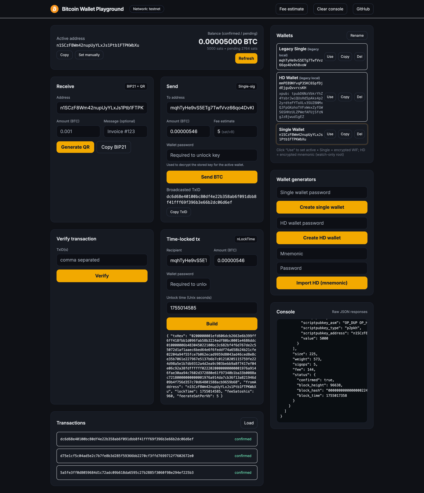

<!-- PROJECT SHIELDS -->

[![Forks][forks-shield]][forks-url]
[![Stargazers][stars-shield]][stars-url]
[![Issues][issues-shield]][issues-url]

# Learn Bitcoin Backend For Wallets

Welcome to **Learn Bitcoin Backend**, an interactive API + minimal UI for experimenting with Bitcoin wallets, transactions, fees, and tooling. It’s a playground you can run locally to learn how wallet backends work.

> ⚠️ **Safety**: This is a learning project. Keys are stored locally (encrypted) using Node’s filesystem. **Do not use with real funds.**

---

## What’s Inside

- Password-protected **keystore** for Single and HD wallets (AES-256-GCM + scrypt + bcrypt)
- Clean **wallet-like UI** (`index.html`) to test endpoints
- Mempool.space API for UTXOs, broadcasting, and fee estimates
- Shared fee utility (avg sat/vB across near-term targets)
- RBF enabled transactions, dust checks, network-aware address validation

## Project Checklist



- [x] Create single wallet (encrypted WIF)
- [x] Create HD wallet (encrypted mnemonic)
- [x] Create Multisig wallet
- [x] Import HD from MNEMONIC
- [x] Get balance of an address
- [x] Get transactions of an address
- [x] Verify transaction
- [x] Send transaction (RBF)
- [x] Receive via BIP21 + QR
- [x] Create time-lock transaction
- [x] Estimate transaction fee
- [x] Validate Bitcoin address
- [x] Fetch historical Bitcoin data
- [x] Reimburse endpoint
- [ ] Recurring payments

## Getting Started

```bash
# 1) Clone
git clone https://github.com/ac12644/bitcoin-api-playground.git
cd bitcoin-api-playground

# 2) Install
npm install

# 3) (Optional) Configure
# Defaults to testnet. You can set NETWORK=mainnet to switch.
# export NETWORK=testnet|mainnet
# export PORT=3000

# 4) Run
node app.js
```

Open http://localhost:3000 for the wallet-style UI.

**Default network:** `testnet` (uses mempool.space testnet4).
Switch network by setting `NETWORK=mainnet` or `NETWORK=testnet`.

---

## How the Keystore Works (TL;DR)

- When you **create** a wallet, you must provide a **password**.
- The server stores:
  - **Single wallet**: encrypted WIF (`AES-256-GCM`) + `bcrypt` hash of your password.
  - **HD wallet**: encrypted mnemonic (same scheme) + derived address/xpub.
- The server returns a **wallet `id`** and public details (address/xpub). No secrets are returned.
- When you **send**/**time-lock**, you provide the **password** and the **walletId** (or fromAddress) to decrypt and sign.

Keystore files live under `./keystore` via `node-localstorage`.

---

## UI Overview (index.html)

- **Wallet Manager**: create Single/HD, import HD, label, set active, copy, delete.
- **Active Address**: shows balance (confirmed/pending), quick refresh.
- **Receive**: BIP21 URI + QR generator.
- **Send**: enter `to`, `amount`, and **your wallet password** (required to sign).
- **Tools**: Verify Tx, Time-Lock (enter unlock timestamp), Fee estimate.
- **Console**: shows raw JSON responses.

---

## API Endpoints

### Wallets

#### Create Single Wallet

- **POST** `/wallet`

- **Body**

  ```json
  { "password": "your-strong-password" }
  ```

- **Response**

  ```json
  { "id": "keystore-id", "address": "tb1..." }
  ```

#### Create HD Wallet

- **POST** `/wallet/hd`

- **Body**

  ```json
  { "password": "your-strong-password" }
  ```

- **Response**

  ```json
  { "id": "keystore-id", "xpub": "tpub...", "address": "tb1..." }
  ```

#### Import HD from Mnemonic

- **POST** `/wallet/retrieve`

- **Body**

  ```json
  { "mnemonic": "abandon ability ...", "password": "your-strong-password" }
  ```

- **Response**

  ```json
  { "id": "keystore-id", "xpub": "tpub...", "address": "tb1..." }
  ```

#### Create Multisig

- **POST** `/wallet/multisig`

- **Body**

  ```json
  {
    "publicKeys": ["pubkey1", "pubkey2", "pubkey3"],
    "requiredSignatures": 2
  }
  ```

- **Response**

  ```json
  { "address": "2N...", "m": 2, "n": 3 }
  ```

---

### Balance & Transactions

#### Get Balance

- **GET** `/transactions/balance/:address`

- **Response**

  ```json
  {
    "confirmedBTC": "0.00500000",
    "pendingBTC": "0.00000000",
    "confirmedSats": 500000,
    "pendingSats": 0
  }
  ```

#### Get Transactions

- **GET** `/transactions/:address`

- **Response**

  ```json
  {
    "transactions": [
      /* mempool.space tx objects */
    ]
  }
  ```

---

### Sending, Time-Lock, Verify

#### Send BTC

- **POST** `/sendbtc`

- **Body**

  ```json
  {
    "to": "tb1...",
    "amount": "0.001",
    "password": "your-strong-password",
    "walletId": "keystore-id" // preferred
    // OR: "fromAddress": "tb1..."    // fallback selector
  }
  ```

- **Response**

  ```json
  { "txId": "hex-txid", "feeSatoshis": 1234, "feerateSatPerVb": 12.3 }
  ```

#### Create Time-Locked Transaction

- **POST** `/timeLock`

- **Body**

  ```json
  {
    "recipientAddress": "tb1...",
    "amountInBTC": "0.001",
    "timestamp": 1767225600, // Unix seconds in the future
    "password": "your-strong-password",
    "walletId": "keystore-id" // preferred
    // OR: "fromAddress": "tb1..."        // fallback selector
  }
  ```

- **Response**

  ```json
  {
    "txHex": "020000...",
    "lockTime": 1767225600,
    "feeSatoshis": 1234,
    "feerateSatPerVb": 12.3
  }
  ```

#### Verify Transaction(s)

- **POST** `/verifyTx`

- **Body**

  ```json
  { "txids": ["txid1", "txid2"] }
  ```

- **Response**

  ```json
  [
    {
      "txid": "txid1",
      "confirmed": true,
      "confirmations": 6,
      "block_height": 123
    },
    { "txid": "txid2", "confirmed": false, "confirmations": 0 }
  ]
  ```

---

### Fees, Address Validation, QR, Historical

#### Estimate Fee

- **GET** `/estimateFee`

- **Response**

  ```json
  { "feerateSatPerVb": 14.2 }
  ```

#### Validate Bitcoin Address

- **GET** `/validateAddress?address=tb1...`

- **Response**

  ```json
  {
    "address": "tb1...",
    "isValid": true,
    "network": "testnet",
    "matchesConfiguredNetwork": true
  }
  ```

#### Payment Request QR (BIP21)

- **GET** `/payment/payment-request-qr?address=tb1...&amount=0.001&message=Invoice%20123`

- **Response**

  ```json
  {
    "success": true,
    "id": "169...",
    "bip21": "bitcoin:tb1...?amount=0.001&message=Invoice%20123",
    "dataUrl": "data:image/png;base64,..." // QR image
  }
  ```

#### Historical Data (CoinGecko)

- **GET** `/historicalData?startDate=2024-01-01&endDate=2024-01-31`

- **Response**

  ```json
  { "prices": [[timestamp, price], ...], "market_caps": [...], "total_volumes": [...] }
  ```

---

## cURL Quickies

```bash
# Create single wallet
curl -X POST http://localhost:3000/wallet \
  -H "Content-Type: application/json" \
  -d '{"password":"secret"}'

# Send BTC (use returned wallet id)
curl -X POST http://localhost:3000/sendbtc \
  -H "Content-Type: application/json" \
  -d '{"to":"tb1...","amount":"0.0005","password":"secret","walletId":"<id>"}'

# Time-lock (unlock at a future unix timestamp)
curl -X POST http://localhost:3000/timeLock \
  -H "Content-Type: application/json" \
  -d '{"recipientAddress":"tb1...","amountInBTC":"0.0005","timestamp":1767225600,"password":"secret","walletId":"<id>"}'
```

---

## Testnet Coins

Grab test BTC from a faucet (e.g. **mempool.space Testnet Faucet** or similar). Make sure your address prefix matches your network (`tb1...` for testnet).

---

## Notes & Limitations

- HD sends currently sign from a single key; for real HD behavior, derive paths (e.g. `m/84'/1'/0'/0/0`) from the decrypted mnemonic. Easy follow-up.
- The **reimburse** endpoint exists; you can adapt it to keystore like `sendbtc` for parity.
- This playground keeps encrypted secrets on local disk. For production, use a proper DB/HSM/KMS and hardened auth.

---

## Contributions

PRs and issues welcome! Spot a bug or want a feature? File an issue or open a PR. 💛

<!-- MARKDOWN LINKS & IMAGES -->

[forks-shield]: https://img.shields.io/github/forks/ac12644/bitcoin-api-playground?style=for-the-badge
[forks-url]: https://github.com/ac12644/bitcoin-api-playground/network/members
[stars-shield]: https://img.shields.io/github/stars/ac12644/bitcoin-api-playground?style=for-the-badge
[stars-url]: https://github.com/ac12644/bitcoin-api-playground/stargazers
[issues-shield]: https://img.shields.io/github/issues/ac12644/bitcoin-api-playground?style=for-the-badge
[issues-url]: https://github.com/ac12644/bitcoin-api-playground/issues
