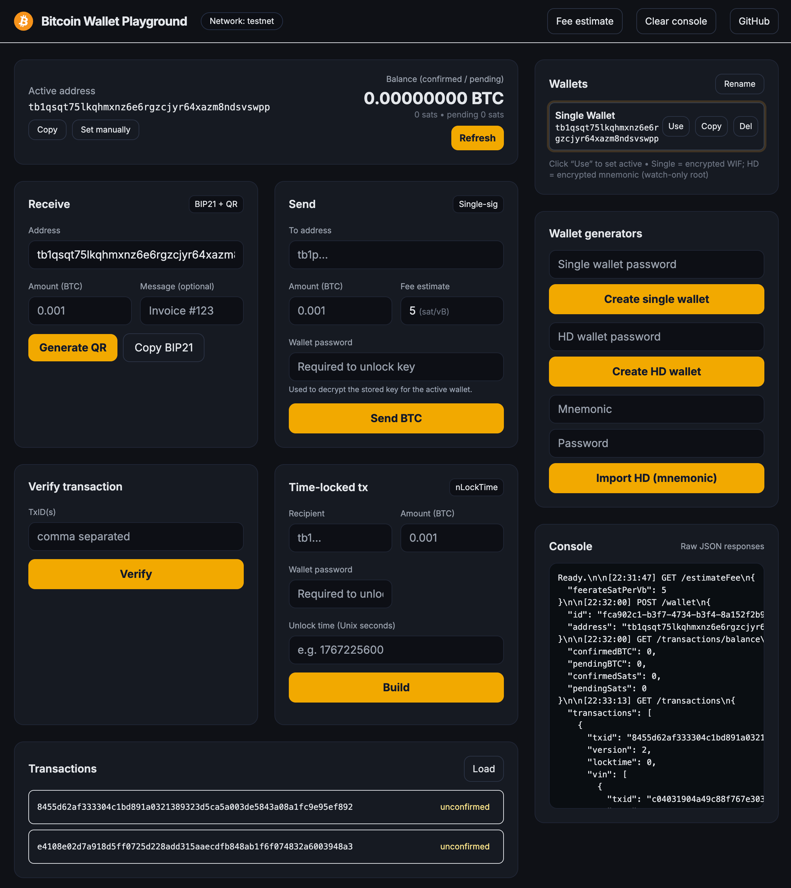

<!-- PROJECT SHIELDS -->

[![Forks][forks-shield]][forks-url]
[![Stargazers][stars-shield]][stars-url]
[![Issues][issues-shield]][issues-url]

# Bitcoin Wallet API (TypeScript) — Password-Protected Keystore

> A learning-friendly Bitcoin wallet backend in **TypeScript** with a simple web UI.
> Create single/HD wallets, store keys encrypted with a **password-protected keystore**, send BTC (RBF), build **time-locked** transactions, generate BIP21 + QR codes, estimate fees, verify txs, and query balances/tx history from mempool.space. **Testnet-ready** by default.

<p align="center">    </p>

## Highlights

- **TypeScript** Node/Express backend
- **Keystore**: AES-256-GCM with scrypt key derivation + bcrypt password hash
- **Single wallets** (encrypted WIF) & **HD wallets** (encrypted BIP39 mnemonic)
- **Send BTC** (RBF), **time-lock** (nLockTime), **reimburse**
- **BIP21 + QR** generator
- **Fee estimate** (sat/vB) and basic **address validation**
- **Balance & transactions** via mempool.space
- Minimal **index.html** UI (no build step)
- Clean migration away from legacy _bitcore_ to **bitcoinjs-lib** + **@scure/bip32/bip39**

---

## Stack

- Runtime: Node.js 18+
- Language: TypeScript
- Web: Express
- Bitcoin: `bitcoinjs-lib`, `@scure/bip32`, `@scure/bip39`, `tiny-secp256k1`
- Crypto: Node `crypto` (AES-256-GCM, scrypt), `bcrypt`
- Data: `node-localstorage` (filesystem) — **for demos only**
- HTTP: `axios`
- QR: `qrcode`

---

## Quick Start

```bash
# 1) Install
npm install

# 2) Dev run (watch)
npm run dev

# 3) Or build + start
npm run build
npm start
```

Open http://localhost:3000 to use the Playground UI.

### Environment

Create `.env` (optional):

```bash
PORT=3000
NETWORK=testnet   # "testnet" (default) or "mainnet"
```

> The UI badge reads the network; API uses mempool.space testnet4/mainnet accordingly.

---

## Project Structure

```
.
├─ index.html                 # Playground UI (served at "/")
├─ src/
│  ├─ server.ts               # Express app wiring (routes + index.html)
│  ├─ controllers/            # All controllers (TS)
│  ├─ routes/                 # Express routers (TS)
│  └─ lib/
│     ├─ net.ts               # NETWORK & mempool API host
│     ├─ fees.ts              # Fee helpers (sat/vB, vsize)
│     └─ keystore.ts          # AES-GCM + bcrypt, localstorage JSON
├─ keystore/                  # Encrypted key records (gitignored)
├─ scratch/                   # Legacy/demo storage (gitignored)
├─ qrCodes/                   # Generated QR cache (gitignored)
├─ .gitignore
├─ package.json
└─ tsconfig.json
```

---

## Security Model (Important)

- **Never** commits secrets: `keystore/`, `qrCodes/`, `scratch/` are **gitignored**.
- Keystore records use:
  - **AES-256-GCM** (random salt + 12-byte IV/nonce + auth tag)
  - **scrypt** (password + salt) to derive encryption key
  - **bcrypt** for server-side password verification
- You **must supply the password** to unlock a wallet (for send / timelock / reimburse).
- For production, consider **HSM/KMS** (Cloud KMS, HashiCorp Vault), proper DB, HTTPS, rate limiting, authN/authZ, audit logging, and _no plaintext mnemonic export_ endpoints.

> This repo is for learning. **Don’t use as-is in production** without hardening.

---

## Scripts

```json
"scripts": {
  "dev": "tsx watch src/server.ts",
  "build": "tsc",
  "start": "node dist/server.js"
}
```

`src/server.ts` simply imports `app` and calls `listen`. You can also run `src/app.ts` directly (it includes a `require.main` guard).

---

## API Overview

All responses are JSON. Errors return `{ error: string }` with appropriate status codes.

### Wallets

#### Create single wallet (encrypted WIF)

```
POST /wallet
```

```json
{ "password": "string" }
```

**200**

```json
{ "id": "keystoreId", "address": "tb1..." }
```

#### Create HD wallet (encrypted mnemonic)

```
POST /wallet/hd
```

```json
{ "password": "string" }
```

**200**

```json
{
  "id": "keystoreId",
  "xpub": "vpub/xpub...",
  "address": "first derived / watch-only"
}
```

> HD derivation: BIP39 mnemonic → seed → BIP32 root (via `@scure/bip39` & `@scure/bip32`).
> We store the **mnemonic encrypted**; return **xpub** for watch-only derivations.

#### Import HD wallet (from mnemonic)

```
POST /wallet/retrieve
```

```json
{ "mnemonic": "word1 ... word12/24", "password": "string" }
```

**200**

```json
{ "id": "keystoreId", "xpub": "vpub/xpub...", "address": "watch-only root" }
```

#### Create Multisig address

```
POST /wallet/multisig
```

```json
{
  "publicKeys": ["02...","03...", "..."],
  "requiredSignatures": 2,
  "script": "p2sh" | "p2wsh" | "p2sh-p2wsh"
}
```

**200**

```json
{
  "address": "2N... / tb1q... / etc",
  "m": 2,
  "n": 3
}
```

#### Retrieve mnemonic (HD only)

```
POST /wallet/mnemonic
```

```json
{ "walletId": "keystoreId", "password": "string" }
```

**200**

```json
{ "mnemonic": "word1 word2 ..." }
```

> Exposing the mnemonic is **dangerous**; keep this endpoint **disabled** in production.

---

### Spending

> For all _send-like_ actions you must provide the **wallet password** and either:
>
> - `walletId` (preferred), or
> - `fromAddress` (the server will look up the keystore record by address).

#### Send BTC (RBF)

```
POST /sendbtc
```

```json
{
  "to": "tb1...",
  "amount": "0.001", // BTC string
  "password": "string",
  "walletId": "keystoreId", // preferred
  "fromAddress": "tb1..." // optional fallback
}
```

**200**

```json
{
  "txId": "hex",
  "feeSatoshis": 1234,
  "feerateSatPerVb": 5.4
}
```

- Picks all UTXOs for `fromAddress`
- Signs with decrypted WIF (single) or derived key (HD, first path)
- RBF enabled (sequence `< 0xFFFFFFFE`)

#### Time-locked transaction (build only)

```
POST /timeLock
```

```json
{
  "recipientAddress": "tb1...",
  "amountInBTC": "0.001",
  "timestamp": 1767225600, // Unix seconds in the future
  "password": "string",
  "walletId": "keystoreId",
  "fromAddress": "tb1..."
}
```

**200**

```json
{
  "txHex": "02000000...",
  "lockTime": 1767225600,
  "feeSatoshis": 1234,
  "feerateSatPerVb": 5.4
}
```

> You can broadcast the hex later via mempool.space or your own broadcaster.

#### Reimburse BTC (same as send, semantic wrapper)

```
POST /reimburseBtc/reimburseBitcoin
```

```json
{
  "to": "tb1...",
  "amount": "0.001",
  "password": "string",
  "walletId": "keystoreId",
  "fromAddress": "tb1..."
}
```

**200**

```json
{
  "txId": "hex",
  "feeSatoshis": 1234,
  "feerateSatPerVb": 5.4
}
```

---

### Read-only & Utilities

#### Address balance

```
GET /transactions/balance/:address
```

**200**

```json
{
  "confirmedBTC": "0.00500000",
  "pendingBTC": "0",
  "confirmedSats": 500000,
  "pendingSats": 0
}
```

#### Address transactions (latest page)

```
GET /transactions/:address
```

**200**

```json
{
  "transactions": [
    /* mempool.space tx objects */
  ]
}
```

#### Verify txids (confirmed? confirmations?)

```
POST /verifyTx
```

```json
{ "txids": ["hex1", "hex2"] } // or a single string
```

**200**

```json
[
  {
    "txid": "hex1",
    "confirmed": true,
    "confirmations": 3,
    "block_height": 123456
  },
  { "txid": "hex2", "confirmed": false, "confirmations": 0 }
]
```

#### Fee estimate (mean of 1..6 targets)

```
GET /estimateFee
```

**200**

```json
{ "feerateSatPerVb": 7.2 }
```

#### Validate address (basic)

```
GET /validateAddress?address=tb1...
```

**200**

```json
{
  "address": "tb1...",
  "isValid": true,
  "network": "testnet",
  "matchesConfiguredNetwork": true
}
```

#### BIP21 + QR

```
GET /payment/payment-request-qr?address=tb1...&amount=0.001&message=Invoice%20123
```

**200**

```json
{
  "success": true,
  "id": "170...",
  "bip21": "bitcoin:tb1...?amount=0.001&message=Invoice%20123",
  "dataUrl": "data:image/png;base64,..."
}
```

#### Historical price data (USD)

```
GET /historicalData?startDate=2024-01-01&endDate=2024-02-01
```

**200**

```json
{ "prices": [...], "market_caps": [...], "total_volumes": [...] }
```

---

## The Playground UI (index.html)

- **Wallet Manager** (right panel): create **Single** or **HD** wallets (requires password), import HD by mnemonic, rename, set active.
- **Active address** (top left): copy/set manually; shows **confirmed/pending** balance.
- **Receive**: BIP21 + **QR** generator.
- **Send**: enter **password** to unlock keystore and sign.
- **Time-lock**: enter **password** to build a future-spendable transaction (returns `txHex`).
- **Console**: shows raw JSON for debugging.

> The UI sends `walletId` (when available) and your **password** to unlock & sign.

---

## Libraries & Rationale

**Use**

- `bitcoinjs-lib` — actively maintained, widely used
- `@scure/bip39` & `@scure/bip32` — modern, audited primitives
- `tiny-secp256k1` — native secp256k1 bindings for bitcoinjs
- `qrcode`, `axios`, `zod` (optionally for input validation)

**Avoid/Removed**

- `bitcore-lib`, `bitcore-mnemonic` — older, not TypeScript-first
- Any lib that’s unmaintained or with unclear security posture

---

## .gitignore (keystore safety)

Already included:

```
bash


CopyEdit
node_modules/
.env
/scratch/
/qrCodes/
/keystore/
**/.DS_Store
```

---

## Deployment

- **Do not** use GitHub Pages/GitHub Actions runners as a backend host.
- Use a server/host that runs Node (Render, Fly.io, Railway, Heroku-like, VPS, Docker/K8s).
- Enable HTTPS, add CORS rules if serving the UI from another origin, add auth/rate limiting.

---

## Troubleshooting

- **“Invalid password”**: the keystore record was found, but bcrypt mismatch.
- **“Address not for configured network”**: you’re on `NETWORK=testnet` but using mainnet addr (or vice versa).
- **Insufficient balance / dust**: ensure amount > dust (~546 sats for legacy p2pkh; similar thresholds for segwit), and covers fee.
- **UTXO empty**: fund your address using a testnet faucet.

---

## Example cURL

```bash
# Create single wallet
curl -sX POST http://localhost:3000/wallet \
  -H "content-type: application/json" \
  -d '{"password":"hunter2"}'

# Send BTC
curl -sX POST http://localhost:3000/sendbtc \
  -H "content-type: application/json" \
  -d '{"to":"tb1q...","amount":"0.0002","password":"hunter2","walletId":"<id>"}'
```

---

## Roadmap / Ideas

- Derivation paths & account management for HD (BIP44/84/86)
- PSBT import/export
- Watch-only xpub accounts with server-side UTXO set
- Replace localstorage with SQLite/Postgres
- Optional Cloud KMS/HSM integration

---

### Disclaimer

This project is for **educational purposes** only. Keys are stored on the server (encrypted), but a compromised server compromises funds. For production, use dedicated key management (HSM/KMS), remove mnemonic export, add authentication, logging, and monitoring.

<!-- MARKDOWN LINKS & IMAGES -->

[forks-shield]: https://img.shields.io/github/forks/ac12644/bitcoin-wallet-api-node?style=for-the-badge
[forks-url]: https://github.com/ac12644/bitcoin-wallet-api-node/network/members
[stars-shield]: https://img.shields.io/github/stars/ac12644/bitcoin-wallet-api-node?style=for-the-badge
[stars-url]: https://github.com/ac12644/bitcoin-wallet-api-node/stargazers
[issues-shield]: https://img.shields.io/github/issues/ac12644/bitcoin-wallet-api-node?style=for-the-badge
[issues-url]: https://github.com/ac12644/bitcoin-wallet-api-node/issues
